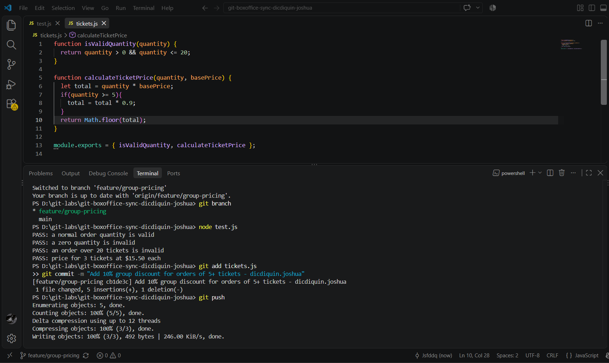
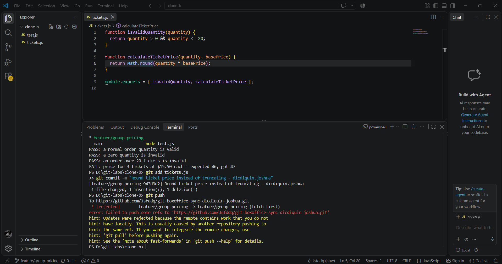
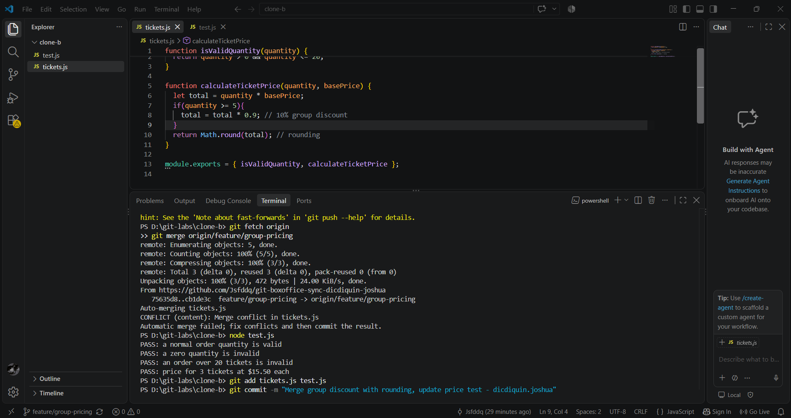
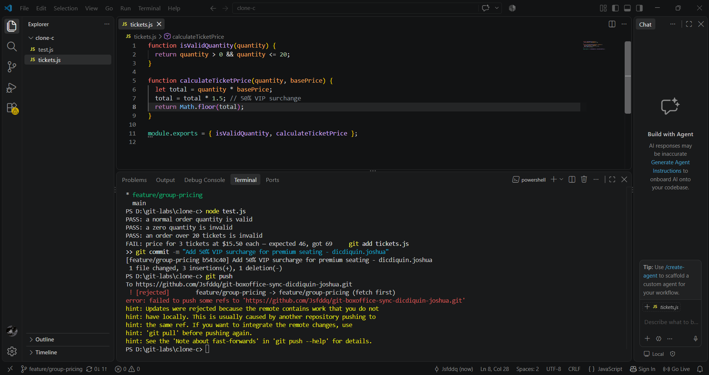
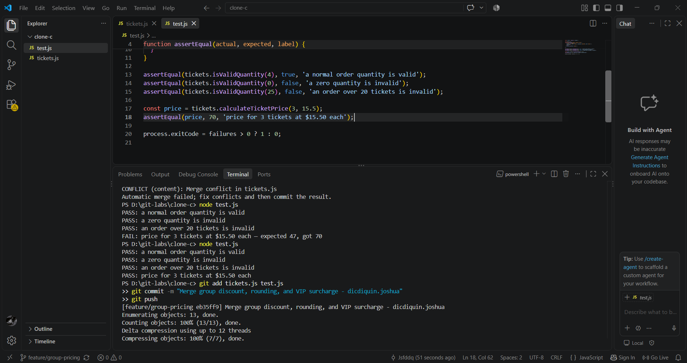
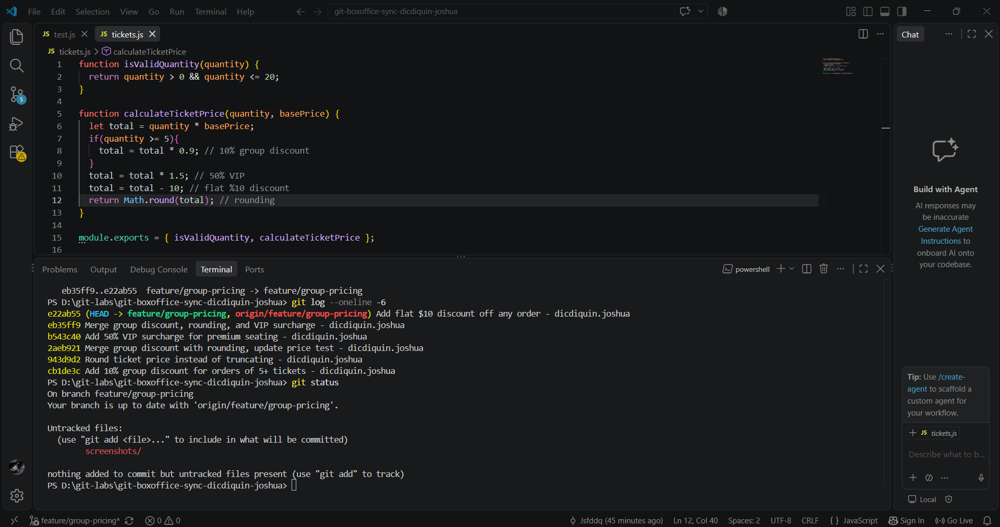
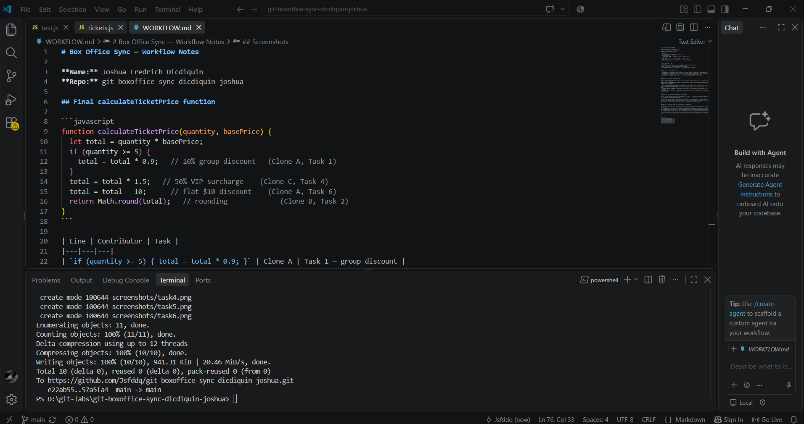

# Box Office Sync — Workflow Notes

**Name:** Joshua Fredrich Dicdiquin
**Repo:** git-boxoffice-sync-dicdiquin-joshua

## Final calculateTicketPrice function

```javascript
function calculateTicketPrice(quantity, basePrice) {
  let total = quantity * basePrice;
  if (quantity >= 5) {
    total = total * 0.9;   // 10% group discount   (Clone A, Task 1)
  }
  total = total * 1.5;   // 50% VIP surcharge    (Clone C, Task 4)
  total = total - 10;      // flat $10 discount    (Clone A, Task 6)
  return Math.round(total);   // rounding             (Clone B, Task 2)
}
```

| Line | Contributor | Task |
|---|---|---|
| `if (quantity >= 5) { total = total * 0.9; }` | Clone A | Task 1 — group discount |
| `total = total * 1.5;` | Clone C | Task 4 — VIP surcharge |
| `total = total - 10;` | Clone A | Task 6 — flat $10 discount |
| `return Math.round(total);` | Clone B | Task 2 — rounding instead of truncating |

---

## Question 1 — Each contributor's part

- **Clone A (Task 1):** introduced the `if (quantity >= 5)` block applying a 10% discount — the group-discount logic.
- **Clone B (Task 2):** changed `Math.floor` to `Math.round`, so the final price is rounded to the nearest cent rather than truncated.
- **Clone C (Task 4):** added `total = total * 1.5`, a 50% VIP surcharge applied to every order.
- **Clone A (Task 6):** added `total = total - 10`, a flat $10 discount applied after the surcharge.

---

## Question 2 — Two-way vs. three-way conflict

Task 3's conflict was a **two-way** reconciliation: Clone A's group discount had to coexist with Clone B's rounding. Two logically independent edits, one obvious merge order.

Task 5's conflict was **three-way**: Clone C's VIP surcharge had to reconcile against a branch that *already contained* the merge of A and B. The difficulty grew non-linearly:

- **Order of operations becomes a decision.** Applying the surcharge before or after the group discount yields different results. Git cannot know which is "right" — a human has to choose.
- **The conflict markers are one-sided.** The incoming side already represented two contributors' work, so one side of the conflict was itself a merge.
- **Trust in the prior merge drops.** In Task 3 you could compare two clean alternatives; in Task 5 you had to trust that the earlier merge (A+B) was correct.
- **Regression surface grows.** Both the discount and rounding paths had to be re-tested against the new surcharge — a third behavior multiplies interaction cases.

---

## Question 3 — Why the flat $10 changed tests unrelated to it

Task 6's flat $10 discount modifies the **final price** of every order — including orders exercising the group-discount and VIP-surcharge paths. The unit tests assert exact numeric values (`assertEqual(price, 60, ...)`), so any change that shifts the final number breaks them, even though the *logic* those tests verified is untouched.

This shows that "isolated changes" in shared code are an illusion. `calculateTicketPrice` is a single output pipeline; a change to any stage is visible at the boundary. Tests are coupled to the pipeline's output, not to individual contributors' lines. The fix is to (a) re-derive expected values whenever a stage is added, and (b) commit the test update alongside the behavior change.

---

## Question 4 — One process change to prevent all three rejected pushes

**Fetch (or pull with rebase) the remote branch before starting work, and push early/frequently instead of holding a local commit until it conflicts.**

All three rejections came from the same root cause: each contributor worked on a stale local view of `origin/feature/group-pricing` and discovered the divergence only at push time. If each teammate had started with `git fetch && git rebase origin/feature/group-pricing` and pushed after every small change, divergences would have been tiny — no long-lived local history, no three-way reconciliation under pressure.

The deeper process fix is a **short-lived-branch policy with mandatory pre-push fetch/rebase**: work items measured in minutes, not hours, and `git pull --rebase` before every push. That converts an "everyone collides at the end" workflow into a "small conflicts, resolved continuously" one.

---

## Screenshots







